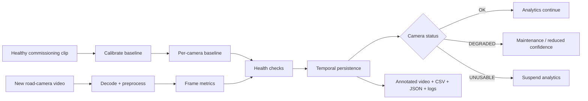

# Road Camera Health Monitor

Automatic health and image-quality monitoring for road, traffic and ITS camera
feeds. Classical computer vision only — OpenCV and NumPy, no deep learning.

It answers one operational question per camera, per frame:

> Is this feed still fit for the analytics running on top of it?

and returns one of three answers, each phrased as an instruction to the
consumer of the feed rather than as a mood:

| Status | Meaning for downstream systems |
|---|---|
| `OK` | Fit for detection / tracking / ANPR / counting |
| `DEGRADED` | Still usable, expect reduced accuracy — raise a maintenance ticket |
| `UNUSABLE` | Suspend analytics for this camera until it is fixed |


## See it in 10 seconds

**What the system does:** calibrate a known-healthy camera → measure every frame → detect blur / exposure / low contrast / occlusion / freeze / movement / shake → apply temporal persistence → emit an operational status and machine-readable reports.



---

## 1. Problem statement

Traffic analytics, ANPR, incident detection, lane analysis and dataset
collection all consume camera feeds and all silently assume those feeds are
good. Cameras degrade constantly and mostly invisibly: lenses drift out of
focus, domes film over, spiders build webs across the housing, the sun blows
out the image twice a day, an iris fails, a stream stalls while still
"connected", a maintenance crew knocks the mount, a pole vibrates in the wind.

The failure mode that matters is not a camera going black. It is a camera that
*looks* fine on a monitor wall while feeding degraded pixels into an analytics
pipeline that keeps reporting numbers with unchanged confidence.

## 2. Why it matters

- **Silent failure is the norm at fleet scale.** Manually eyeballing hundreds
  or thousands of camera images is not a process, it is a wish. Commercial VMS
  platforms ship dedicated camera-integrity products precisely because of this.
- **It gates downstream confidence, not just maintenance.** The same signal
  that schedules a truck roll should also suppress or down-weight analytics
  output while the camera is impaired. A vehicle count from a fogged camera is
  worse than no count, because it looks like data.
- **False alarms destroy the whole thing.** If the monitor cries wolf, operators
  switch the alerts off and the system is worth nothing. Every design decision
  in this repository is downstream of that constraint, which is why persistence
  logic and per-camera calibration are not optional extras here.

## 3. The central design decision: baseline-relative detection

**This is the part that makes the project more than a pile of thresholds.**

Almost every image-quality metric worth computing is scene dependent. A
Laplacian variance of 90 is excellent for a camera pointed at an empty desert
highway and terrible for one pointed at a tree line. An absolute threshold
therefore cannot be both sensitive and specific across a fleet — you either
miss real defocus on detailed scenes or permanently alarm on plain ones.

So the tool characterises each camera in its healthy state and detects
*deviation from that camera's own normal*:

```
road-health calibrate --input healthy_clip.mp4 --output baseline.json
```

A baseline stores, per camera:

- robust location and scale (median and MAD, not mean and std — the calibration
  clip contains traffic, shadows and the occasional parked truck) for nine
  metrics;
- per-tile texture statistics on a grid, so occlusion can be localised;
- a **temporal-median background image** of the commissioned field of view — a
  deterministic background model that needs no training and no per-pixel state
  at runtime, and which doubles as the geometric reference for "has this camera
  moved".

Thresholds are then expressed as fractions of that camera's own median.
Absolute thresholds survive only for quantities with the same physical meaning
on every sensor (pixel clipping) or as an explicitly-labelled fallback.

## 4. Architecture

```
video ──► input validation ──► frame decode ──► ROI crop + fixed-scale grey
                                                         │
                                                         ▼
                                              per-frame metrics (9)
                                                         │
                          per-camera baseline ──────────►│
                                                         ▼
                                       health rules + reliability gates
                                                         │
                                                         ▼
                                   temporal persistence (leaky-bucket debounce)
                                                         │
                                                         ▼
                                       frame status  ──►  events
                                                         │
             ┌──────────────┬───────────────┬────────────┴──────────┐
             ▼              ▼               ▼                       ▼
   annotated_video.mp4  frame_metrics.csv  events.json   run_metadata.json + run.log
```

Three ideas carry most of the weight:

**Measurement is separate from decision.** `metrics.py` never decides anything;
`health_checks.py` never measures anything. That separation is what makes
threshold calibration, the sweep in `EVALUATION.md` and offline re-scoring
possible at all.

**"Not checked" is never rendered as "healthy".** If a frame is blown out, its
edge structure has collapsed for reasons that have nothing to do with framing,
so the `moved` check reports **unavailable**, not *passing*. Rules that infer a
fault from missing structure stand down when something else already destroyed
the structure. This is the mechanism that produced the clean confusion matrix
in §10 — without it, blur, overexposure and occlusion all masquerade as camera
movement.

**Persistence, not per-frame alarms.** A truck passing close to the lens
flattens the histogram for four frames; a bird lands on the housing; one frame
drops and the inter-frame difference goes to zero. See §7.

## 5. Features

| Condition | Severity | Primary metric | Core idea |
|---|---|---|---|
| `blur` | DEGRADED | `reblur_ratio` | Re-blur the frame with a known kernel; a sharp frame has high-frequency energy left to destroy, a defocused one does not. Largely cancels scene dependence. |
| `dark` | DEGRADED | `mean_luma`, `clip_low_frac` | Low light is **not** a fault. Fires only when information is actually lost: blacks crushed, or level far below normal *and* usable range collapsed with it. |
| `bright` | DEGRADED | `clip_high_frac` | Saturated pixels carry no information whatever the cause. Sun glare is folded in here on purpose rather than given a separate rule. |
| `low_contrast` | DEGRADED | `contrast_span` (p95−p05) | Fog/haze/filmed-over dome. Gated on normal exposure: haze compresses the histogram toward the middle, exposure faults compress it against a rail. |
| `blocked` | UNUSABLE | `dead_tile_frac` | A tile is occluded when its texture collapsed **more than the frame as a whole did**. That normalisation is what separates a covered lens from a dark or foggy scene. |
| `frozen` | UNUSABLE | `frame_mad` vs noise floor | A live imager always produces temporal noise (MAD ≈ 1.128 σ); a stalled decoder produces none. Self-calibrating per camera and per gain setting. |
| `moved` | UNUSABLE | phase correlation on edge maps | Displacement and structural correlation against the commissioned reference view. |
| `shake` | DEGRADED | std-dev of displacement | Unstable mount. Same measurement as `moved`, different temporal signature: a moved camera settles at a new offset, a shaking one oscillates around the old one. |

Supporting features: ROI masking for burnt-in OSD banners (sharp, static, and
otherwise capable of masking a frozen stream entirely); fixed analysis
resolution so thresholds are portable between a 1080p and a 4CIF camera;
frame-stride for throughput; typed CLI exit codes; codec fallback when `mp4v`
is unavailable.

## 6. Metrics, limitations and calibration

Every rule's docstring in `src/road_health/health_checks.py` states what it
measures, how thresholds should be calibrated, and its specific false
positive / false negative modes. Summarised:

| Metric | Known limitation |
|---|---|
| `lap_var` | Strongly scene dependent — never compared across cameras, only to the same camera's baseline. |
| `reblur_ratio` | Degenerate on a featureless frame: 0/0 evaluates to 0, i.e. "maximally defocused". Handled upstream — a uniform frame is classified `blocked`, which suppresses `blur`. Asserted in `test_reblur_ratio_is_degenerate_on_a_featureless_frame`. |
| `edge_density` | Fixed Canny hysteresis is acceptable only because the value is compared to the same camera's baseline, never to a constant. |
| `clip_*_frac` | The only genuinely camera-independent quantities; absolute thresholds on them are defensible. |
| `noise_sigma` | Lossy re-encoding suppresses sensor noise. Measured on the frame itself each time rather than assumed. |
| `frame_mad` | A very-low-bitrate encoder emitting skip-blocks on a static scene mimics a freeze. |
| `shift_frac` / `edge_corr` | Cannot distinguish an operator-commanded PTZ preset from a knock — the VMS has to supply PTZ state, or disable the check on PTZ cameras. |

## 7. Temporal logic

Per-condition leaky-bucket de-bounce with asymmetric fill and drain:

```
bad frame   level += 1                        (clamped at enter_frames)
good frame  level -= enter_frames/exit_frames
raise  when level >= enter_frames
clear  when level <= 0
```

Chosen over "N consecutive bad frames" because it tolerates intermittent good
frames inside a real fault (a branch swinging in and out of view) while still
requiring a majority of bad frames over the window, so it does not latch on
sparse noise. Raise and clear times are tuned independently.

**All hold-down times are configured in seconds, never frames**, and converted
using `source_fps / analysis.stride`. The same config file therefore behaves
identically on a 10 fps and a 30 fps camera, and raising `stride` for
throughput does not silently change the alarm behaviour.

## 8. Quick start

```bash
git clone https://github.com/Tamer1020/road-camera-health-monitor.git
cd road-camera-health-monitor

python -m venv .venv
source .venv/bin/activate      # Windows: .venv\\Scripts\\activate
pip install -r requirements-dev.txt

# Generate a licence-free healthy road clip and controlled fault clips.
python scripts/make_sample_data.py -o sample_data/road_clean.mp4 -n 400
python scripts/make_eval_corpus.py

# Calibrate from a known-healthy commissioning clip.
road-health calibrate \
  --input sample_data/eval/normal.mp4 \
  --output sample_data/eval/baseline.json

# Inspect a partial camera-obstruction example.
road-health inspect-video \
  --input sample_data/eval/blocked_partial.mp4 \
  --output outputs/demo \
  --baseline sample_data/eval/baseline.json \
  --config configs/default.yaml \
  --camera-id ROAD-CAM-07 \
  --no-status-exit

pytest -q
```

Expected outputs:

```
outputs/demo/
├── annotated_video.mp4
├── frame_metrics.csv
├── events.json
├── run_metadata.json
└── run.log
```

## 9. CLI

```text
road-health calibrate --input VIDEO --output BASELINE [--config CFG]
road-health inspect-video --input VIDEO --output DIR [--baseline FILE|auto] [--config CFG]
```

Exit codes are typed so the tool can be called from automation:

| Code | Meaning |
|---:|---|
| 0 | success |
| 2 | invalid arguments / config |
| 3 | input not found |
| 4 | unsupported or corrupt input |
| 5 | baseline error / incompatibility |
| 6 | output failure |
| 10 | run completed with DEGRADED status |
| 11 | run completed with UNUSABLE status |

## 10. Evaluation

The controlled evaluation corpus contains 11 synthetic clips × 400 frames at
25 fps, with exact frame-level ground truth and no third-party footage.

| Clip | Condition | Steady-state recall | Detection latency | Hold-down | Clean FP frames |
|---|---|---:|---:|---:|---:|
| blur | blur | 1.000 | 51 fr (2.04 s) | 50 | 0 |
| dark | dark | 1.000 | 64 fr (2.56 s) | 50 | 0 |
| bright | bright | 1.000 | 68 fr (2.72 s) | 50 | 0 |
| low_contrast | low_contrast | 1.000 | 91 fr (3.64 s) | 75 | 0 |
| blocked_partial | blocked | 1.000 | 85 fr (3.40 s) | 75 | 0 |
| blocked_full | blocked | 1.000 | 85 fr (3.40 s) | 75 | 0 |
| frozen | frozen | 1.000 | 52 fr (2.08 s) | 50 | 0 |
| moved | moved | 1.000 | 77 fr (3.08 s) | 75 | 0 |
| shake | shake | 1.000 | 80 fr (3.20 s) | 75 | 0 |
| blur_from_start | blur | 1.000 | 49 fr (1.96 s) | 50 | 0 |

**Clean clip: 0 false-alarm events, 100% `OK`.**

The confusion matrix is strictly diagonal on this corpus: zero off-diagonal
entries across 11 clips × 8 conditions.

## 11. Auto vs file baseline

The decisive case is `blur_from_start`, where the camera is already out of
focus when monitoring begins.

| Baseline mode | Detected? | Steady-state recall | Events |
|---|---|---:|---:|
| `file` (calibrated at commissioning) | yes, at 49 frames | 1.000 | 1 |
| `auto` (self-calibrated from clip head) | **never** | 0.000 | 0 |

On the other ten clips the two modes are identical to the digit, because every
one of them starts healthy — which is exactly the assumption `auto` makes. This
single clip is the whole argument for the `calibrate` command: self-calibration
learns the fault as normal and reports a healthy camera forever.

## 12. Benchmark

Single container core, 640×360 @ 25 fps source, 400 frames, OpenCV 4.13.
`scripts/benchmark.py`, raw output in `outputs/benchmark/benchmark.json`.

| Configuration | Source fps | Analysis-only fps | × realtime |
|---|---:|---:|---:|
| Full pipeline + annotated video | 57.6 | 64.3 | 2.31 |
| Analysis only (`--no-video`) | 66.5 | 68.7 | 2.66 |
| Analysis only, `--stride 3` | **195.6** | 71.1 | **7.82** |
| Analysis only, `max_side: 320` | 87.5 | 91.2 | 3.50 |

Per-stage cost, full pipeline, ms per analysed frame:

| Stage | ms |
|---|---:|
| metrics | 15.375 |
| write_video | 0.953 |
| decode | 0.414 |
| annotate | 0.338 |
| preprocess | 0.113 |
| checks | 0.052 |
| temporal | 0.009 |

Two numbers are reported deliberately: `pipeline_fps_end_to_end` counts **source
frames** consumed per second, and `analysis_fps_excluding_io` counts frames the
health logic processed excluding decode and video writing. The first is the one
that says whether the tool keeps up with a live feed. Quoting analysed frames
when `stride > 1` understates throughput by the stride factor —
`test_throughput_is_reported_in_source_frames` guards against that regression,
which was present in an earlier version of this benchmark.

Metrics dominate at 94% of pipeline cost. Tile statistics were moved to
summed-area tables and registration to a reduced scale during development,
roughly doubling throughput; the remaining cost is dominated by the two Canny
passes and the Laplacian evaluations.

## 13. Known limitations

**Read this section before trusting any number above.**

1. **The evaluation is synthetic.** The source video is procedurally generated
   and the faults are injected. Numbers here are *lower bounds on sensitivity
   and upper bounds on latency under controlled conditions*, not field accuracy.
2. **One baseline describes one lighting regime.** A camera running 24/7
   through a 100:1 illumination swing needs one baseline per regime (day /
   dusk / night), selected on a schedule. With a single daytime baseline the
   exposure rules will misbehave at night. Not implemented.
3. **PTZ cameras.** The tool cannot see VMS commands, so a commanded preset
   change is indistinguishable from a knock. Feed PTZ state in, or disable
   `moved`/`shake` on PTZ cameras.
4. **Absolute-threshold fallback is weak.** With `--no-baseline`, `moved` and
   `shake` are unavailable outright, and the remaining thresholds are scene
   dependent. It exists for triage, not production.
5. **Single-camera, offline, file-based.** No RTSP ingestion, no fleet
   dashboard, no scheduler, no alert routing.
6. **Whole-frame rules.** A lens soft in only one corner will not trigger
   `blur`, which is global.
7. **Thresholds were selected on this corpus.** They are development-set
   choices. The sweep in `docs/EVALUATION.md` shows broad plateaus rather than
   sharp optima — evidence of calibration rather than fitting — but they are
   not validated on held-out real data.
8. **`shake` is the weakest rule.** Best raw-flag F1 is 0.719; it only becomes
   reliable after the 3 s hold-down. Treat it as advisory.

## 14. Failure cases

Concrete situations where this tool gives the wrong answer:

| Situation | Behaviour | Why |
|---|---|---|
| Frozen stream on an already-degraded camera | `frozen` reports **unavailable** | Below the minimum noise floor a stalled stream and a crushed-but-live one are genuinely indistinguishable from pixels alone. Deliberately declines to guess. |
| Lens covered by a *textured* obstruction (leafy branch, spider web) | `blocked` misses it | The rule detects loss of texture; a branch adds edges. |
| Lens covered by opaque black tape | `blocked` fires, `dark` co-fires | Correct status (UNUSABLE), attribution ambiguous. Both are listed in `co_active`. |
| Very-low-bitrate encoder, static night scene | `frozen` may false-fire | The encoder emits skip-blocks; decoded frames really are identical. |
| Operator-commanded PTZ preset change | `moved` fires | No access to VMS state. |
| Heavy snow covering the whole scene | `blocked` may fire | Texture genuinely disappears. |
| Large white box truck parked in front of the camera | `blocked` fires | Arguably a true positive for a monitoring camera. |
| Burnt-in OSD banner, stream stalls | `frozen` misses it | The banner clock keeps changing. Use `analysis.roi`. |
| Camera legitimately at night with a working IR illuminator | No alarm | By design — low light is not a fault unless information is lost. |

## 15. Synthetic evaluation vs real-world validation

**These are not the same thing and this repository has only done the first.**

| | Controlled synthetic evaluation (done) | Real-world validation (not done) |
|---|---|---|
| Source | Procedurally generated road scene | Real camera recordings across seasons, weather, day/night |
| Faults | Injected with exact frame-level ground truth | Naturally occurring, hand-annotated |
| Fault realism | Idealised: clean polygons, smooth ramps, exact frame repeats | Gradual drift over hours, spider webs, partial freezes, rain streaks |
| What it proves | The rules fire on the phenomena they target, do not cross-fire, and do not alarm on clean input | That the thresholds transfer to real optics, codecs and weather |
| What it cannot prove | Field false-alarm rate — the number that decides adoption | — |

Synthetic source video is in the repository for two defensible reasons, not
convenience: public road footage is almost never redistributable, and only a
generated scene gives a controllable sensor noise floor, which the freeze
detector is explicitly calibrated against.

**To validate on real footage:** record a healthy clip per camera, run
`calibrate`, then run `inspect-video` on held-out recordings containing known
incidents. `docs/EVALUATION.md` §7 gives the procedure. `.gitignore` excludes
`data/` so third-party recordings are never committed.

## 16. Repository structure

```
road-camera-health-monitor/
├── src/road_health/
│   ├── config.py           dataclasses, YAML deep-merge, validation, s->frames
│   ├── errors.py           typed errors mapped to CLI exit codes
│   ├── io.py               input validation, decode, writer with codec fallback
│   ├── metrics.py          the 9 per-frame measurements (decides nothing)
│   ├── baseline.py         robust stats, median background, save/load, compat checks
│   ├── health_checks.py    the rules and reliability gates (measures nothing)
│   ├── temporal.py         leaky-bucket debounce, event tracking, status
│   ├── pipeline.py         orchestration and staged timing
│   ├── reporting.py        CSV / events / metadata / logging
│   ├── visualization.py    annotated overlay
│   └── cli.py              inspect-video, calibrate
├── configs/default.yaml    every threshold, documented
├── scripts/
│   ├── make_sample_data.py generate a licence-free road clip
│   ├── make_eval_corpus.py inject controlled faults, emit ground truth
│   ├── run_evaluation.py   score, confusion matrix, threshold sweep
│   └── benchmark.py        end-to-end throughput
├── tests/                  99 tests
├── docs/EVALUATION.md
└── .github/workflows/ci.yml
```

## 17. Testing and CI

```bash
pytest -q        # 99 tests, ~15 s
```

Coverage: config validation and deep-merge; **a regression test asserting
`configs/default.yaml` has not drifted from the built-in defaults** (a drift bug
that actually occurred during development and silently disabled a check while
every run still looked successful); invalid / unsupported / corrupt / truncated
inputs; known-answer metric tests (Immerkær noise estimator against injected
σ, the 1.128 σ MAD identity the freeze rule rests on, summed-area tile stats
against a naive loop, displacement against a known pixel shift); rule threshold
logic including every reliability gate; de-bounce hysteresis and leaky-bucket
behaviour; event onset, duration and peak tracking; end-to-end runs; CLI exit
codes.

CI (`.github/workflows/ci.yml`) runs on Python 3.10/3.11/3.12 and:

1. runs the unit tests;
2. **executes the exact commands in this README's quick start** — if the README
   drifts from reality, CI fails;
3. asserts every documented artefact was produced and that the CSV row count
   matches the metadata frame count;
4. runs the full ground-truthed evaluation and **fails the build** if
   steady-state recall drops below 0.95 on any condition, if any condition
   stops being detected, or if the clean clip produces any false alarm.

## 18. Future work

Ordered by value, not by how impressive it sounds:

1. **Validate on real footage.** Everything else is secondary to this.
2. **Time-of-day baselines** with scheduled selection — the most important
   correctness gap for 24/7 deployment.
3. **RTSP ingestion and a fleet-level service** — per-camera state, alert
   routing, a status API. The current tool is the analysis core of that, not
   the product.
4. **Confidence output for downstream consumers**, so analytics can down-weight
   rather than merely be suspended.
5. **Localised blur** via per-tile sharpness, reusing the existing grid.
6. **Textured-occlusion detection** (spider webs, branches), the main gap in
   `blocked`. This is the first place where a learned model would be justified
   — and only after demonstrating that the classical rule cannot be made to
   work, which has not been demonstrated yet.

## 19. Licence

MIT. See `LICENSE`.
