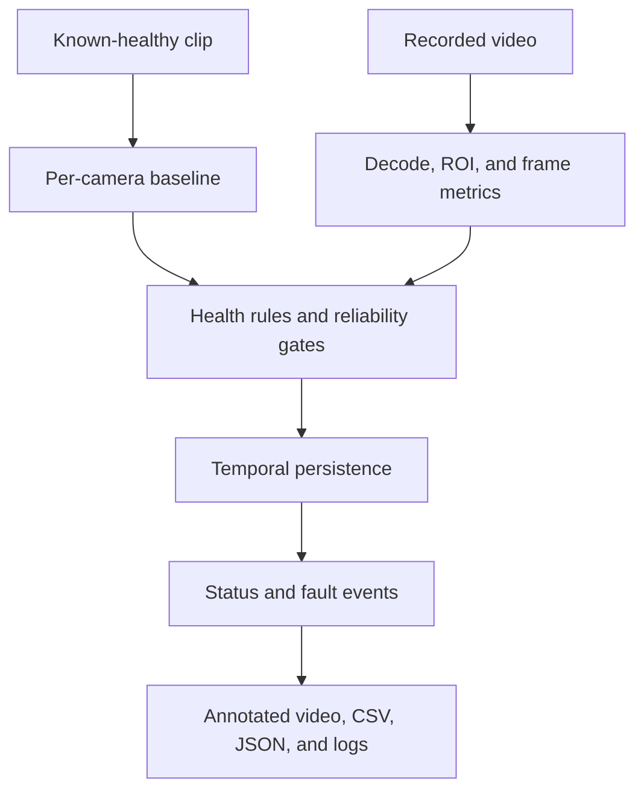

# Road Camera Health Monitor
### Camera reliability for perception pipelines

[](https://github.com/Tamer1020/road-camera-health-monitor/actions/workflows/ci.yml)
[Watch demo](#60-second-demo) · [Evaluation](docs/EVALUATION.md) · [Quick start](#quick-start) · [Design](docs/DESIGN.md)

An OpenCV and NumPy pipeline that detects camera degradation in recorded road
video and emits persistent fault events, annotated video, and CSV/JSON reports.
It uses per-camera calibration and classical computer vision; no trained model
or GPU is required.

**Purpose:** give downstream detection, tracking, and traffic analytics a
camera-health signal they can inspect before relying on the images.

## 60-second demo

https://github.com/user-attachments/assets/54c06913-7894-4275-a542-194573580871

**[Open video](https://github.com/user-attachments/assets/54c06913-7894-4275-a542-194573580871) · [MP4 file](docs/demo/road-camera-health-demo.mp4).** Actual pipeline
outputs: blur, obstruction, frozen frames, and a synchronized baseline comparison.
*Synthetic scene + injected faults; 1× playback, with on-screen explanations.
This is a demonstration, not real-world validation or a new benchmark.*
[Reproduce the video and inspect its evidence](docs/DEMO.md).

## Results at a glance

**Reported results from the controlled synthetic evaluation and container
benchmark.** The corpus contains 11 clips derived from one generated scene:
10 fault clips and one clean clip, each 400 frames at 25 fps and 640×360.
Thresholds were selected on this corpus; it is not a held-out field dataset.

| Evidence | Reported result | Scope |
|---|---|---|
| Full pipeline throughput | **57.6 source frames/s — 2.31× realtime** | Includes annotated-video output; 640×360, 25 fps input, 400 frames, OpenCV 4.13, reported container environment |
| Fault detection | **100% steady-state recall** for each target fault clip | Eight fault types; measured after the fault ramp and configured hold-down, using a known-healthy file baseline |
| Clean-clip behavior | **0 false-alarm events** | One 400-frame clean synthetic clip: **16 seconds** of observation, not a field false-alarm rate |
| Alarm latency | **1.96–3.64 s** across the fault clips | Measured from the labelled fault onset; includes temporal hold-down |
| Calibration comparison | Startup blur: **1.000 recall with file baseline; 0.000 with auto baseline** | The `blur_from_start` synthetic case shows the risk of learning an existing fault as normal |
| Engineering checks | **99 documented automated tests**; CI matrix for Python **3.10 / 3.11 / 3.12** | Unit/integration tests, CLI smoke runs, output checks, and a separate synthetic-evaluation regression gate |

**How to read the detection number:** steady-state recall excludes startup/ramp
and hold-down frames. Whole-window precision and recall are lower and are
reported alongside it in the [full results](docs/EVALUATION.md#4-detection-results--file-baseline).
No downstream detector-accuracy improvement, real-camera false-alarm rate, or
target Edge-device throughput has been established.

## What it does

| Condition | Default status | Detection signal |
|---|---|---|
| Blur | `DEGRADED` | Re-blur sharpness relative to the camera baseline |
| Dark / bright exposure | `DEGRADED` | Lost image information, luma, and clipped pixels |
| Low contrast | `DEGRADED` | Compressed intensity range with exposure gating |
| Obstruction | `UNUSABLE` | Local texture loss relative to frame-wide changes |
| Frozen frames | `UNUSABLE` | Inter-frame difference relative to estimated noise |
| Camera movement | `UNUSABLE` | Registration against the commissioned view |
| Camera shake | `DEGRADED` | Temporal variation in displacement |

Statuses are emitted as diagnostics for a consumer to act on. This repository
does not automatically stop another analytics service or open maintenance tickets.
`OK` means no monitored fault is currently active; it does not certify that every
check was available or that a downstream model will be accurate. Unreliable
checks are reported separately as **unavailable**.

## Engineering decisions

- **Calibrate each camera against its healthy state.** Robust median/MAD
  statistics and a temporal-median reference view make decisions relative to
  that camera's scene. The startup-blur comparison above explains why the
  commissioning baseline matters.
- **Separate measurement from decisions.** Frame metrics, health rules,
  temporal logic, and reporting live in separate modules. Stored metrics also
  support offline threshold sweeps.
- **Require persistent evidence.** Per-condition leaky buckets use separate
  entry and recovery times, configured in seconds and adjusted for frame stride.
- **Expose uncertainty.** Reliability gates mark checks unavailable when
  exposure, contrast, or noise makes their evidence unreliable.
- **Profile the complete pipeline.** The benchmark separates source throughput
  from analysis throughput. Tile statistics use summed-area tables and
  registration uses reduced resolution.

These are the project's portfolio strengths for **Computer Vision and
Perception**: image-quality analysis, calibration, temporal decisions, failure
analysis, and reproducible evaluation. For **Edge AI** roles, the profiling and
CPU implementation are relevant engineering evidence; deployment, memory,
power, and sustained performance on target hardware remain unmeasured.


```mermaid
flowchart TD
    A["Known-healthy clip"] --> B["Per-camera baseline"]
    C["Recorded video"] --> D["Decode, ROI, and frame metrics"]
    B --> E["Health rules and reliability gates"]
    D --> E
    E --> F["Temporal persistence"]
    F --> G["Status and fault events"]
    G --> H["Annotated video, CSV, JSON, and logs"]
```

See the [design reference](docs/DESIGN.md) for the rules, metric caveats,
temporal logic, CLI exit codes, and concrete failure cases.

## Quick start

Requires Python 3.10 or newer. Run from the repository root.

```bash
git clone https://github.com/Tamer1020/road-camera-health-monitor.git
cd road-camera-health-monitor

python -m venv .venv
source .venv/bin/activate
# Windows PowerShell: .venv\Scripts\Activate.ps1

python -m pip install -e ".[dev]"

# Generate the synthetic source and controlled fault clips.
python scripts/make_sample_data.py -o sample_data/road_clean.mp4 -n 400
python scripts/make_eval_corpus.py

# Calibrate from a known-healthy clip.
road-health calibrate \
  --input sample_data/eval/normal.mp4 \
  --output sample_data/eval/baseline.json

# Inspect an injected partial obstruction.
road-health inspect-video \
  --input sample_data/eval/blocked_partial.mp4 \
  --output outputs/demo \
  --baseline sample_data/eval/baseline.json \
  --config configs/default.yaml \
  --camera-id ROAD-CAM-07 \
  --no-status-exit
```

Open `outputs/demo/annotated_video.mp4` to view the result (the writer may use
a fallback codec/container when needed). The same directory contains:

| Output | Purpose |
|---|---|
| `frame_metrics.csv` | Per-frame measurements and health decisions |
| `events.json` | Fault events, onset, and duration |
| `run_metadata.json` | Run configuration and timing information |
| `run.log` | Operational diagnostics |

`--no-status-exit` makes a completed demo run return 0. Without it, detected
`DEGRADED` or `UNUSABLE` states return 10 or 11; these indicate detected faults,
not a failed execution. See the [CLI reference](docs/DESIGN.md#cli-and-exit-codes).

To reproduce the documented evaluation and collect timings on your own machine:

```bash
pytest -q
python scripts/run_evaluation.py --baseline-mode file
python scripts/run_evaluation.py --baseline-mode auto
python scripts/benchmark.py
```

Evaluation reports are generated under `outputs/evaluation/{file,auto}/`;
benchmark output is written to `outputs/benchmark/benchmark.json`. These are
generated local outputs, not checked-in evidence files. New runtime measurements
will depend on your machine and environment.

## Validation boundaries

| Implemented and evaluated in the documented scope | Current limitation | Next validation or implementation step |
|---|---|---|
| Eight fault rules with labelled synthetic clips | Thresholds were selected on the same generated scene | Evaluate held-out real recordings from multiple cameras |
| Zero alarms on the clean synthetic clip | Only 16 seconds of clean observation | Measure false-alarm events per camera-hour over extended recordings |
| Per-camera file and auto baselines | Auto mode can learn an existing fault; one baseline covers one lighting regime | Add and evaluate day/dusk/night baseline selection |
| Single-camera processing of video files | No live RTSP ingestion or fleet service | Add stream lifecycle handling, per-camera state, and alert routing |
| Container throughput benchmark | CPU model, affinity/thread limits, memory, power, and Edge-device results are not documented in the published table | Record environment details and benchmark a named target device |
| Image-quality status and reports | No measured impact on detector/tracker accuracy | Evaluate the monitor alongside a downstream perception task |

Additional known failure modes: textured obstructions such as branches can evade
`blocked`; low-bitrate static scenes can resemble frozen streams; commanded PTZ
movement can trigger `moved`; blur is global and can miss one soft corner.
`shake` is advisory: the documented best raw-rule F1 is **0.719**, before temporal
filtering. [Failure cases](docs/DESIGN.md#failure-cases) and
[evaluation limits](docs/EVALUATION.md#8-what-this-evaluation-proves--and-what-it-does-not)
describe the details.

## Next steps

1. Validate on held-out real footage and report false alarms over meaningful durations.
2. Implement day/dusk/night baseline selection.
3. Add RTSP ingestion and a fleet service.
4. Measure sustained throughput and resource use on a named Edge device.
5. Evaluate downstream confidence integration, local blur, and textured obstructions.

These are future tasks, not current capabilities or measured results.

## Project guide

| Entry | Start here for |
|---|---|
| [Design reference](docs/DESIGN.md) | Calibration, rules, temporal logic, CLI, and failure cases |
| [Evaluation report](docs/EVALUATION.md) | Corpus, scoring definitions, per-clip results, sweeps, and benchmark |
| [Demo and reproduction](docs/DEMO.md) | Finished 60-second video, capture provenance, captions, and rendering commands |
| [Portfolio presentation](docs/PORTFOLIO.md) | GitHub About copy, topics, social preview, and publishing checklist |
| [Default config](configs/default.yaml) | Thresholds and hold-down times |
| [Source](src/road_health) / [tests](tests) | Implementation and regression coverage |
| [CI workflow](.github/workflows/ci.yml) | Test matrix, CLI smoke runs, artefact checks, and evaluation gate |

**CI behavior:** the test job runs on Python 3.10–3.12 and checks a generated-video
CLI run and its output artefacts. The separate evaluation job fails if any fault
clip's steady-state recall falls below 0.95, a target condition is never detected,
or the clean clip produces a false-alarm event. These gates check regressions on
the synthetic corpus; they do not establish field performance.

## License

MIT. See [LICENSE](LICENSE).

