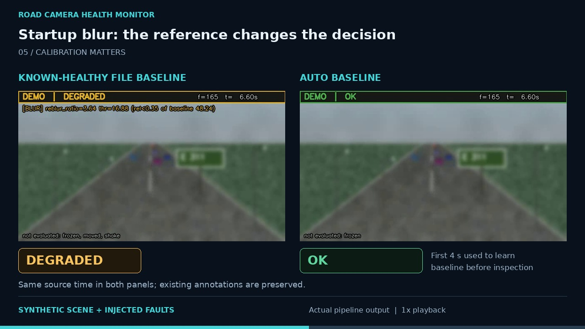

# 60-second demo

[Project overview](../README.md) · [Watch video](https://github.com/user-attachments/assets/54c06913-7894-4275-a542-194573580871) · [MP4 file](demo/road-camera-health-demo.mp4) · [Evaluation](EVALUATION.md)

[](https://github.com/user-attachments/assets/54c06913-7894-4275-a542-194573580871)

**60 seconds · 1280×720 · 25 fps · captioned, without audio.** The video was
assembled from real executions of this repository on its procedurally generated
scene and injected fault clips. It is not real-road validation. The source
annotation and its `not evaluated` warnings remain visible.

## What the video shows

| Demo time | Actual capture | What to inspect |
|---|---|---|
| 0–5 s | Healthy clip, source 0–5 s | Per-camera reference and structured outputs |
| 5–11.52 s | Blur clip, source 5–11.52 s | Raw flag changes before the persistent alarm |
| 11.52–19 s | Partial obstruction, source 5–12.48 s | Local texture loss and the original tile annotation |
| 19–25 s | Frozen clip, source 5–11 s | Image content holds while source timestamps advance |
| 25–35 s | Startup blur, source 0–10 s in both panels | Healthy file reference versus auto baseline |
| 35–43 s | Generated JSON and selected CSV columns | Raw evidence onset versus persistent-state activation |
| 43–54 s | Previously published evaluation figures | Every result appears beside its scope |
| 54–60 s | Repository link and next steps | Real-camera, Edge-hardware, and RTSP work remains future work |

Source ranges are half-open. All moving excerpts play at **1×**; chapter cuts
switch cases. The side-panel state and boolean flags come from the same frame's
CSV row. No alarm was moved earlier or drawn into a source frame.

Auto baseline is an **offline pre-pass**: it learns from the first 100 frames
(4 seconds) before inspection starts again at frame 0. The comparison states
this explicitly; it does not simulate a live warm-up screen.

## Capture provenance and evidence

The published capture used source commit
`a79c134678911aec8155cfc5b3c1fa6ae7447ba3`, `configs/default.yaml`, Python 3.12.14,
OpenCV 4.14.0, and NumPy 2.3.5. The scene generator used seed 7; injected faults
used seed 11. Each source clip contains 400 frames at 640×360 and 25 fps.

- [Capture manifest](demo/capture-manifest.json): versions, source revision,
  configuration hash, source-file hashes, state transitions, and edit ranges.
- [Original obstruction event JSON](demo/evidence/blocked-partial-events.json).
- [CSV excerpt around activation](demo/evidence/blocked-partial-transition.csv):
  five original rows and the four columns displayed in the video.
- [English captions](demo/road-camera-health-demo.srt).
- [Video renderer](../scripts/render_portfolio_demo.py).

The 57.6 source-fps / 2.31× card repeats the **historical OpenCV 4.13 container
benchmark** in [EVALUATION.md](EVALUATION.md#10-benchmark). It is not a speed
measurement from this new recording. Likewise, the 100% result is steady-state
recall on the synthetic development corpus after ramp and hold-down, and zero
false alarms refers to one 16-second clean synthetic clip. The published
evaluation table has not been replaced with this capture's runtime timings.

## Reproduce the capture and edit

From a checkout of this repository, install the project and the optional video
renderer dependency. The renderer also needs FFmpeg with libx264 on PATH and
DejaVu Sans fonts. The default font directory is the standard Linux location;
use `--font-dir` to point to another directory containing `DejaVuSans.ttf`,
`DejaVuSans-Bold.ttf`, and `DejaVuSansMono.ttf`.

```bash
python -m pip install -e . "Pillow>=10,<13"

python scripts/make_sample_data.py -o sample_data/road_clean.mp4 -n 400
python scripts/make_eval_corpus.py
python -m road_health.cli calibrate \
  --input sample_data/eval/normal.mp4 \
  --output sample_data/eval/baseline.json \
  --config configs/default.yaml

for clip in normal blur blocked_partial frozen blur_from_start; do
  python -m road_health.cli inspect-video \
    --input "sample_data/eval/$clip.mp4" \
    --output "outputs/demo_capture/file/$clip" \
    --baseline sample_data/eval/baseline.json \
    --config configs/default.yaml \
    --camera-id DEMO --no-status-exit || exit $?
done

python -m road_health.cli inspect-video \
  --input sample_data/eval/blur_from_start.mp4 \
  --output outputs/demo_capture/auto/blur_from_start \
  --config configs/default.yaml \
  --camera-id DEMO --no-status-exit

python scripts/render_portfolio_demo.py \
  --source-revision "$(git rev-parse HEAD)" \
  --output outputs/portfolio-demo/road-camera-health-demo.mp4
```

`--preview-only` generates review frames under `outputs/demo_render/` before
encoding. The renderer checks source dimensions, frame counts, the CSV timebase,
and the expected qualitative behaviors; a changed capture stops the edit so the
captions can be reviewed. It never changes detection thresholds to obtain a shot.
New runs can differ with dependency versions; inspect them before publishing.

For the full evaluation, independently run the commands in
[EVALUATION.md](EVALUATION.md). Rendering the demo is not a substitute
for that evaluation or for held-out real-camera testing.

## Separate illustration

The [original three-panel illustration](road_camera_health_monitor_hero_final.jpg)
uses a real road-video frame with injected OpenCV blur and obstruction. It is
separate from the procedurally generated scene in this video and from the
synthetic evaluation. It does not establish real-world performance.
